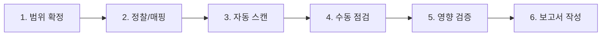

# 웹 진단 워크플로우

> **이 페이지의 역할**: 점검 항목별로 어떤 문서를 봐야 하는지 알려주는 인덱스.
> 실제 작업할 땐 사이드바에서 바로 페이지를 열거나 검색창을 이용하세요.
> Priority 1 + 2 합쳐 **22개 페이지 작성 완료** (2026-05). 표에 "(예정)" 으로 표시된 항목은 미작성 — `_migration-plan.md` 참조.

---

## 진단 단계 (Phase)

| 단계 | 목적 | 관련 도구/문서 |
| :--- | :--- | :--- |
| **1. 범위 확정** | 점검 대상 URL, 인증 정보, 제외 항목 확정 | (계약/협의 산출물) |
| **2. 정찰/매핑** | 페이지 구조, 엔드포인트, 파라미터 식별 | Burp Sitemap, [ffuf](/cheatsheet/web-application/ffuf), [gobuster](/cheatsheet/web-application/gobuster) |
| **3. 자동 스캔** | 알려진 취약점 빠르게 검출 | ZAP, Burp Scanner, [wpscan](/cheatsheet/web-application/wpscan) |
| **4. 수동 점검** | 비즈니스 로직, 권한, 입력값 등 수동 검증 | **본 디렉토리의 각 페이지** |
| **5. 영향 검증** | 실제 위협으로 이어지는지 PoC 입증 | 각 페이지의 "PoC 양식" 섹션 |
| **6. 보고서 작성** | 결함 보고서 정리 | 각 페이지의 "PoC 양식" + "대응방안" 그대로 활용 |

---

## 점검 항목 ↔ 페이지 매핑 (OWASP Top 10 2025)

> [OWASP Top 10 2025](https://owasp.org/Top10/2025/) 기준. 2021 대비 카테고리 순서/구성이 변경되었으니 주의.

| OWASP 2025 카테고리 | 관련 진단 페이지 |
| :--- | :--- |
| **A01:2025 - Broken Access Control** | [authorization-idor](./authorization-idor), [csrf](./csrf), [open-redirect](./open-redirect), [lfi](./lfi) |
| **A02:2025 - Security Misconfiguration** | [security-headers](./security-headers), [cors](./cors), [information-disclosure](./information-disclosure) |
| **A03:2025 - Software Supply Chain Failures** | (외부 도구 - retire.js, OWASP Dependency-Check, Snyk) |
| **A04:2025 - Cryptographic Failures** | [crypto-failures](./crypto-failures) (예정) |
| **A05:2025 - Injection** | [sql-injection](./sql-injection), [xss](./xss), [command-injection](./command-injection), [ssti](./ssti), [ssrf](./ssrf), [xxe](./xxe), [nosql-injection](./nosql-injection) |
| **A06:2025 - Insecure Design** | [business-logic](./business-logic), [race-condition](./race-condition) |
| **A07:2025 - Authentication Failures** | [authentication](./authentication), [session-management](./session-management), [jwt-attacks](./jwt-attacks) |
| **A08:2025 - Software or Data Integrity Failures** | [insecure-deserialization](./insecure-deserialization), [file-upload](./file-upload) |
| **A09:2025 - Security Logging and Alerting Failures** | [logging-monitoring](./logging-monitoring) (예정) |
| **A10:2025 - Mishandling of Exceptional Conditions** | [error-handling](./error-handling) |

> **주요 변경점 (2021 → 2025)**:
> - SSRF가 별도 카테고리(2021 A10)에서 빠지고 A05 Injection 군으로 통합
> - "Vulnerable Components"가 "Software Supply Chain Failures"로 확장되어 A03으로 상승
> - "Security Misconfiguration"이 A05에서 A02로 상승 (실무 빈도 증가 반영)
> - "Mishandling of Exceptional Conditions"이 A10으로 신규 진입

---

## 점검 항목 ↔ 페이지 매핑 (KISA 주요 정보통신기반시설 기술적 취약점 분석·평가)

> 회사에서 정해진 점검 체크리스트가 나오면 이 표를 그에 맞춰서 갱신할 것.

| KISA 분류 | 점검 항목 | 관련 페이지 |
| :--- | :--- | :--- |
| 입력값 검증 | SQL 인젝션 | [sql-injection](./sql-injection), [nosql-injection](./nosql-injection) |
| 입력값 검증 | 운영체제 명령 실행 | [command-injection](./command-injection) |
| 입력값 검증 | XSS (Cross-Site Scripting) | [xss](./xss) |
| 입력값 검증 | 파일 업로드 | [file-upload](./file-upload) |
| 입력값 검증 | 파일 다운로드 / Path Traversal | [lfi](./lfi) |
| 입력값 검증 | 템플릿 인젝션 (SSTI) | [ssti](./ssti) |
| 입력값 검증 | XXE / 역직렬화 | [xxe](./xxe), [insecure-deserialization](./insecure-deserialization) |
| 인증/인가 | 인증 우회 | [authentication](./authentication), [jwt-attacks](./jwt-attacks) |
| 인증/인가 | 권한 상승 (수직/수평) | [authorization-idor](./authorization-idor) |
| 세션 관리 | 세션 고정 / 예측 가능한 토큰 | [session-management](./session-management) |
| 세션 관리 | 자동완성 / 쿠키 속성 | [session-management](./session-management) |
| 정보 노출 | 디렉토리 인덱싱 / 에러 메시지 | [information-disclosure](./information-disclosure), [error-handling](./error-handling) |
| 정보 노출 | 백업/임시 파일 노출 | [information-disclosure](./information-disclosure) |
| 비즈니스 로직 | 가격 조작 / 수량 조작 | [business-logic](./business-logic) |
| 비즈니스 로직 | Race Condition | [race-condition](./race-condition) |
| 설정 미흡 | 보안 헤더 누락 | [security-headers](./security-headers) |
| 설정 미흡 | CORS 잘못된 설정 | [cors](./cors) |
| 클라이언트 | CSRF | [csrf](./csrf) |
| 외부 요청 | SSRF | [ssrf](./ssrf) |
| 외부 요청 | XXE | [xxe](./xxe) |
| 외부 요청 | Open Redirect | [open-redirect](./open-redirect) |

---

## 환경 설정 (작업 시작 전 체크)

> 별도 환경설정 페이지로 분리 예정. 지금은 체크리스트만.

- [ ] Burp Suite CA 인증서 브라우저에 설치
- [ ] 점검 대상 도메인을 Burp Target Scope에 추가
- [ ] 점검용 테스트 계정 2개 이상 발급받음 (수평 권한 점검용)
- [ ] 자동 스캔 허용 여부 / 제외 URL 확인
- [ ] 점검 시간대 협의 (운영 영향 최소화)
- [ ] 로그/증적 저장 위치 준비 (Burp 프로젝트 파일 + 스크린샷 폴더)

---

## 참고자료

- [OWASP Top 10 2025](https://owasp.org/Top10/2025/)
- [OWASP WSTG (Web Security Testing Guide)](https://owasp.org/www-project-web-security-testing-guide/)
- [KISA 주요 정보통신기반시설 기술적 취약점 분석·평가 방법 상세가이드](https://www.kisa.or.kr/2060204/form?postSeq=14)
- [PortSwigger Web Security Academy](https://portswigger.net/web-security)
- [HackTricks - Pentesting Web](https://book.hacktricks.xyz/network-services-pentesting/pentesting-web)
