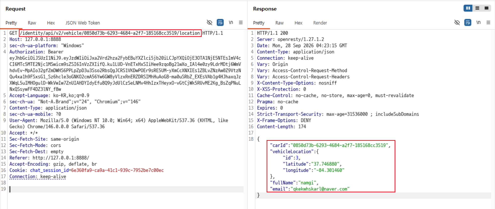
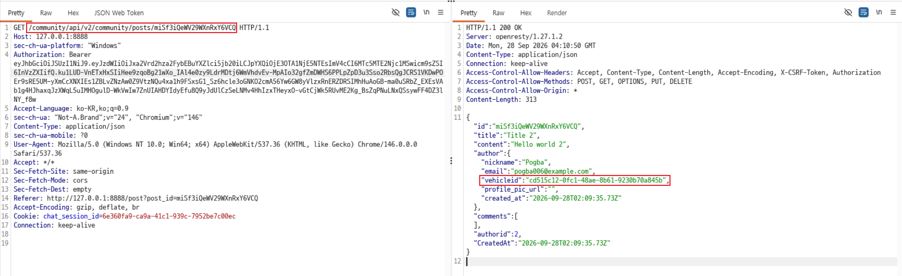
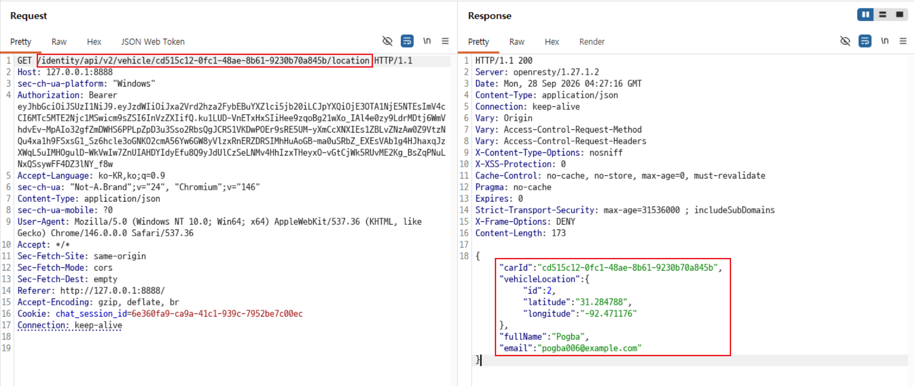

# C1. 다른 사용자의 차량 정보 조회

## 배경 개념

- **인증(Authentication):** 요청을 보낸 사용자가 누구인지 확인함. 여기서는 Bearer 토큰으로 로그인 상태를 확인함.
- **인가(Authorization):** 그 사용자가 요청한 차량 정보를 볼 권한이 있는지 확인함.
- **BOLA (Broken Object Level Authorization, 객체 수준 권한 부여 오류):** API가 요청에 포함된 객체 ID를 처리하면서, 해당 사용자가 그 객체에 접근할 권한이 있는지 확인하지 않아 생기는 문제임. UUID처럼 추측하기 어려운 ID를 사용해도 권한 검사가 빠지면 발생할 수 있음.

## 관찰 과정

- 포럼 글의 API 응답에서 작성자 정보와 `vehicleid`를 확인했다.
- 차량 위치 조회 요청은 `/identity/api/v2/vehicle/{vehicleId}/location` 경로를 사용했다.
- 내 계정의 인증 토큰으로 다른 사용자의 차량 ID를 넣어 요청하자 `200 OK`와 차량 위치 및 소유자 정보가 반환됐다.

## 재현 절차 및 증적

1. 내 계정으로 로그인하고 내 차량의 위치 조회 요청과 응답을 확인함.

   

2. 포럼 글 응답에서 다른 사용자의 `vehicleid`를 확인함.

   

3. Repeater에서 위치 조회 요청의 차량 ID만 다른 사용자의 ID로 바꾸고, 내 인증 토큰은 유지해 요청함.
4. `200 OK`와 다른 차량의 위치 및 소유자 정보가 반환된 것을 확인함.

   

## 분석

서버가 요청을 보낸 사용자의 인증은 처리했지만, 요청한 차량이 그 사용자의 소유인지 확인하지 않았다. 따라서 다른 사용자의 차량 위치와 소유자 정보에 접근할 수 있었다. 이는 객체 ID를 바꿨을 때 객체 단위 권한 검사가 누락되는 BOLA 사례다.

## 대응 방안

서로 다른 두 계정과 각 계정의 객체를 준비하고, 계정 A의 인증 상태에서 계정 B 객체 ID를 요청해 접근 통제를 확인한다. 서버는 매 요청마다 로그인 사용자에게 해당 객체를 읽을 권한이 있는지 검사해야 한다. 성공·실패 상태 코드뿐 아니라 응답에 실제 객체 데이터가 포함되는지도 확인한다.
