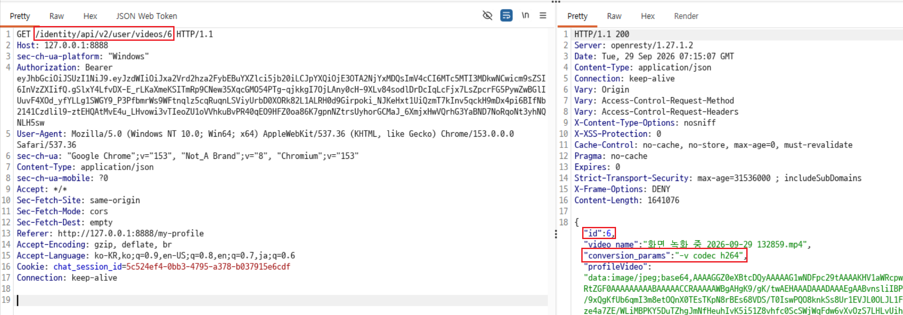
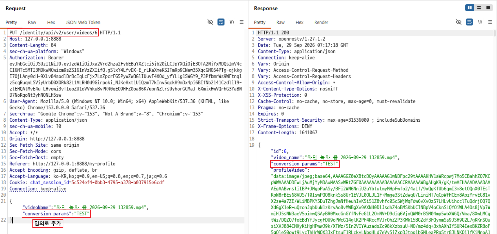
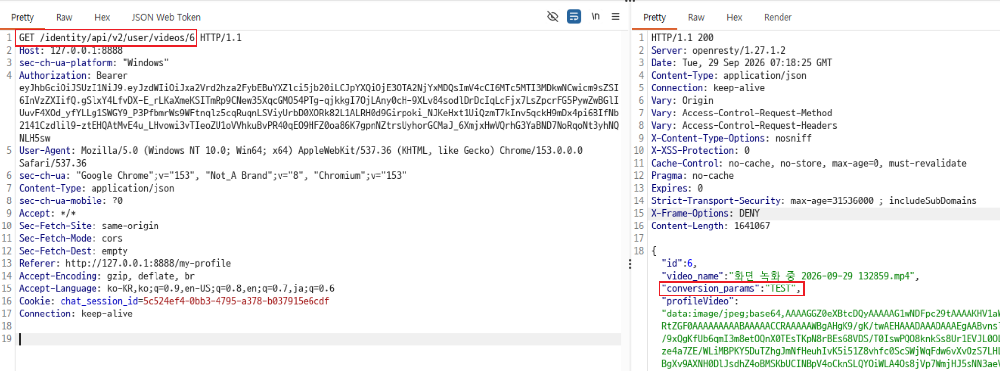

# C10. 동영상 내부 속성 수정

## 배경 개념

- **내부 속성:** 영상 변환 옵션처럼 서비스 내부 처리에만 사용되는 값은 일반 사용자에게 노출하거나 수정 권한을 주어서는 안 됨.
- **대량 할당:** API가 요청 본문의 필드를 객체에 그대로 반영하면, 화면에서 제공하지 않은 내부 필드까지 사용자가 추가·수정할 수 있음.

## 관찰 과정

- `GET /identity/api/v2/user/videos/6` 응답에서 동영상 ID `6`의 내부 변환 속성 `conversion_params`가 `-v codec h264`로 노출됨.
- 동영상 수정 API는 사용자 인터페이스에서 사용하는 `videoName`과 함께 `conversion_params`를 요청 본문에 추가해 전송할 수 있었음.
- `PUT /identity/api/v2/user/videos/6` 요청에서 내부 속성 값을 `TEST`로 변경하자 `200 OK` 응답에 변경값이 반영됨.
- 같은 동영상 정보를 다시 조회했을 때도 `conversion_params: TEST`가 유지됨.

## 재현 절차 및 증적

1. `GET /identity/api/v2/user/videos/6` 요청으로 동영상 정보를 조회하여 내부 변환 속성 `conversion_params: -v codec h264`를 확인함.

   

2. `PUT /identity/api/v2/user/videos/6` 요청 본문에 UI에서 사용하는 `videoName`과 함께 `conversion_params: TEST`를 추가하여 전송함. `200 OK` 응답에서 내부 속성 값이 `TEST`로 변경된 것을 확인함.

   

3. `GET /identity/api/v2/user/videos/6` 요청으로 동영상 정보를 다시 조회하여 변경한 `conversion_params: TEST` 값이 유지되는 것을 확인함.

   

## 분석

동영상 수정 API는 일반 사용자가 변경할 수 있는 영상 이름뿐 아니라 내부 변환 설정인 `conversion_params`까지 요청 본문에서 받아 저장했다. 서버는 수정 가능한 속성을 허용 목록으로 제한하지 않았고, 내부 설정값의 변경 권한도 검증하지 않았다. 그 결과 사용자 인터페이스에 없는 필드를 임의로 추가해 영상 변환 동작에 영향을 주는 내부 속성을 영구적으로 변경할 수 있었다.

## 대응 방안

일반 사용자용 동영상 수정 API는 `videoName`처럼 업무상 필요한 필드만 명시적으로 허용해야 한다. `conversion_params`는 요청·응답 DTO에서 제외하고 서버가 신뢰할 수 있는 고정값 또는 관리자 전용 설정으로 관리해야 한다. 또한 요청 스키마의 미정의 필드는 거부하고, 내부 처리 옵션의 변경은 별도 권한 검증·감사 로그가 적용된 관리 기능으로 분리해야 한다.
