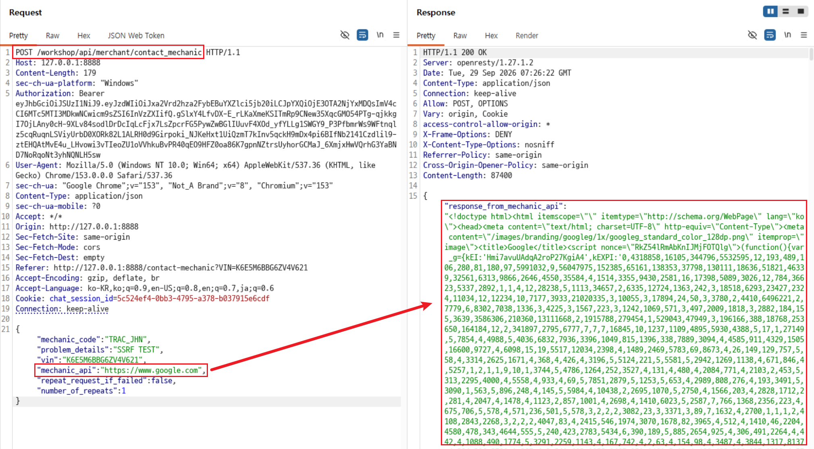

# C11. Contact Mechanic API의 SSRF

## 배경 개념

- **SSRF(Server-Side Request Forgery):** 서버가 사용자 입력으로 전달된 URL에 요청을 보내도록 유도하는 취약점임. 공격자는 서버의 네트워크 위치와 권한을 이용해 외부·내부 자원에 접근할 수 있음.
- **URL 검증:** 외부 연동 URL을 입력받는 기능은 허용된 대상인지 검증해야 하며, 사용자가 임의의 프로토콜·호스트·포트를 지정하지 못하게 해야 함.

## 관찰 과정

- Contact Mechanic 기능은 `POST /workshop/api/merchant/contact_mechanic` 요청 본문의 `mechanic_api` 값을 사용해 정비사 API에 요청을 전달함.
- 정상 흐름에서는 `mechanic_api`가 정비 보고서 수신 API를 가리키지만, 요청 본문에서 임의의 외부 URL로 변경할 수 있었음.
- `mechanic_api`를 `https://www.google.com`으로 변경해 전송하자 서버가 Google에 요청한 결과가 `response_from_mechanic_api` 필드에 반환됨.

## 재현 절차 및 증적

1. 본인 차량 정보와 정비사 코드가 포함된 `POST /workshop/api/merchant/contact_mechanic` 요청을 Repeater로 전송함. 요청 본문의 `mechanic_api`를 `https://www.google.com`으로 변경함.

   

2. 응답의 `response_from_mechanic_api`에서 `<!doctype html>`과 `<title>Google</title>`을 확인함. 이는 클라이언트가 아닌 crAPI 서버가 지정한 외부 URL로 요청을 보내고, 그 응답을 다시 반환한 결과임.

## 분석

서버는 `mechanic_api`에 전달된 URL의 목적지를 제한하지 않고 요청을 전송했다. 그 결과 사용자가 Google URL을 지정하자 서버가 대신 요청을 수행하고 응답 본문을 반환했다. 실제 서비스에서는 이 동작을 악용해 내부 전용 서비스, 클라우드 메타데이터 주소 또는 접근이 제한된 관리 인터페이스에 대한 서버 측 요청을 유도할 수 있다.

## 대응 방안

정비사 연동 대상은 사용자 입력이 아닌 서버 측 설정의 허용 목록으로 관리해야 한다. URL을 꼭 입력받아야 한다면 HTTPS만 허용하고, DNS 해석 결과와 리디렉션 대상까지 검증하여 사설·루프백·링크 로컬 IP 대역 및 내부 도메인을 차단해야 한다. 또한 외부 응답 본문을 그대로 사용자에게 반환하지 말고, 연동에 필요한 최소 결과만 반환하며 아웃바운드 네트워크 정책으로 허용된 대상 외 연결을 제한해야 한다.
