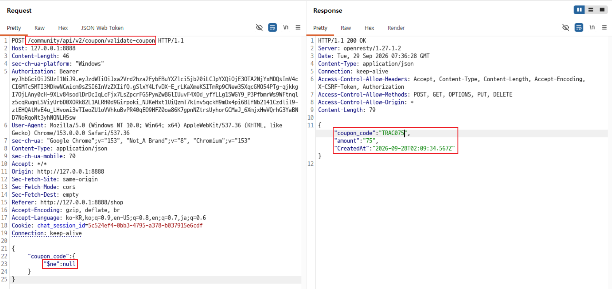
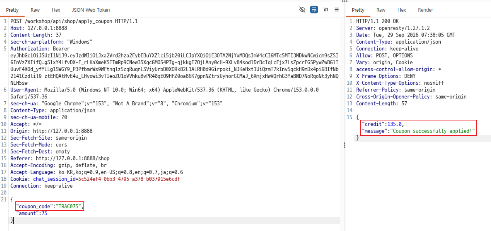

# C12. NoSQL Injection으로 쿠폰 코드 획득

## 배경 개념

- **NoSQL Injection:** 사용자 입력을 NoSQL 데이터베이스의 질의 객체로 그대로 처리할 때, 공격자가 연산자나 조건을 주입해 의도하지 않은 문서를 조회·변경하는 취약점임.
- **MongoDB `$ne` 연산자:** `$ne`는 지정한 값과 같지 않은 문서를 선택함. 쿠폰 코드가 `null`이 아닌 문서를 찾도록 하면 실제 코드를 모른 채 유효 쿠폰을 반환받을 수 있음.
- **조건 비교:** NoSQL Injection은 오류 메시지만으로 확정하지 않고, 존재하지 않는 문자열 요청과 연산자 객체 요청의 결과가 반복해서 달라지는지 비교해야 함.

## 관찰 과정

- 쿠폰 검증 API인 `POST /community/api/v2/coupon/validate-coupon`은 `coupon_code` 값을 받아 쿠폰 정보를 반환함.
- 일반 문자열 대신 `coupon_code`에 `$ne` 연산자를 포함한 객체를 전송할 수 있었음.
- `{"coupon_code":{"$ne":null}}` 요청이 쿠폰 코드 `TRAC075`와 금액 `75`를 반환함.
- 반환된 실제 쿠폰 코드와 금액을 `POST /workshop/api/shop/apply_coupon`에 전송하자 쿠폰 적용 성공과 크레딧 `135.0`이 반환됨.

## 재현 절차 및 증적

1. `POST /community/api/v2/coupon/validate-coupon` 요청 본문에 아래 NoSQL 연산자 객체를 전송함.

   ```json
   {
     "coupon_code": {
       "$ne": null
     }
   }
   ```

   `200 OK` 응답에서 사전에 알지 못했던 유효 쿠폰 코드 `TRAC075`와 금액 `75`가 반환된 것을 확인함.

   

2. 반환된 값을 사용해 `POST /workshop/api/shop/apply_coupon` 요청을 전송함.

   ```json
   {
     "coupon_code": "TRAC075",
     "amount": 75
   }
   ```

   `Coupon successfully applied!` 메시지와 크레딧 `135.0`을 확인함.

   

## 분석

쿠폰 검증 API는 `coupon_code`를 문자열로 제한하지 않고 MongoDB 질의에 사용할 수 있는 객체 형태로 처리했다. 공격자는 `$ne: null` 조건을 전달해 쿠폰 코드가 존재하는 임의의 문서와 일치시켰고, 그 결과 유효 쿠폰 코드와 금액을 획득했다. 이후 획득한 값을 쿠폰 적용 API에 사용해 실제 크레딧으로 전환할 수 있었다.

### 추가로 확인할 수 있는 기법

- **참·거짓 기준 비교:** 우선 존재하지 않는 문자열로 실패 기준을 기록한 뒤, 같은 위치만 연산자 객체로 변경해 비교한다. 예를 들어 아래 두 요청의 결과가 일관되게 다르면 입력이 단순 문자열이 아니라 질의 조건으로 해석될 가능성이 높다.

  ```json
  {"coupon_code":"__NO_MATCH__"}
  ```

  ```json
  {"coupon_code":{"$ne":"__NO_MATCH__"}}
  ```

- **정규식 조건:** `$ne`가 차단되거나 조건 차이를 추가 확인해야 할 때, 테스트 데이터 범위에서만 `$regex`의 참·거짓 패턴을 비교할 수 있다. 예를 들어 `{"coupon_code":{"$regex":"^TRAC"}}`와 일치하지 않는 접두어를 비교한다. 쿠폰 코드를 대량 추측하거나 복잡한 정규식으로 부하를 유발하는 방식은 사용하지 않는다.

- **입력 형식 차이:** JSON 객체가 거절되더라도 폼 또는 URL 쿼리를 받는 다른 API에서는 `coupon_code[$ne]=__NO_MATCH__`가 서버 측에서 중첩 객체로 변환될 수 있다. 이는 해당 API가 실제로 폼 요청을 지원할 때만 확인하며, JSON API에 그대로 적용하지 않는다.

이 사례에서 취약점을 확정하는 근거는 `$ne` 객체 요청으로 유효 쿠폰 코드와 금액이 실제로 반환되고, 그 쿠폰이 적용 API에서 크레딧으로 전환된 점이다.

## 대응 방안

쿠폰 코드는 문자열 타입과 허용 형식을 서버 측 스키마에서 엄격히 검증해야 한다. 데이터베이스 질의에는 사용자가 전달한 객체 전체가 아닌 검증된 문자열 값만 바인딩하고, `$`로 시작하는 연산자 키나 중첩 객체는 거부해야 한다. 쿠폰 검증 응답은 필요한 최소 정보만 반환하며, 비정상적인 검증 요청과 짧은 시간 내 반복된 쿠폰 조회를 모니터링·차단해야 한다.
