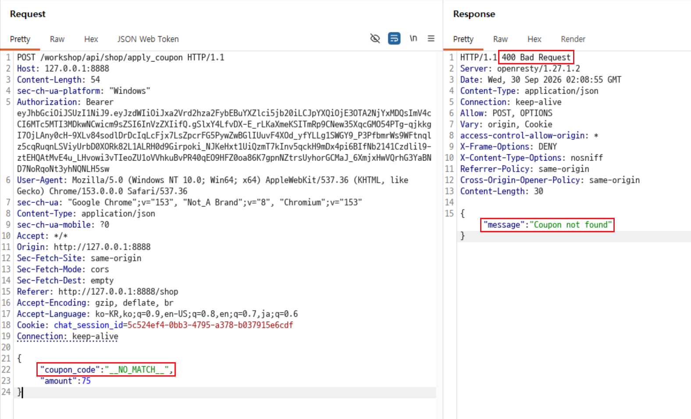
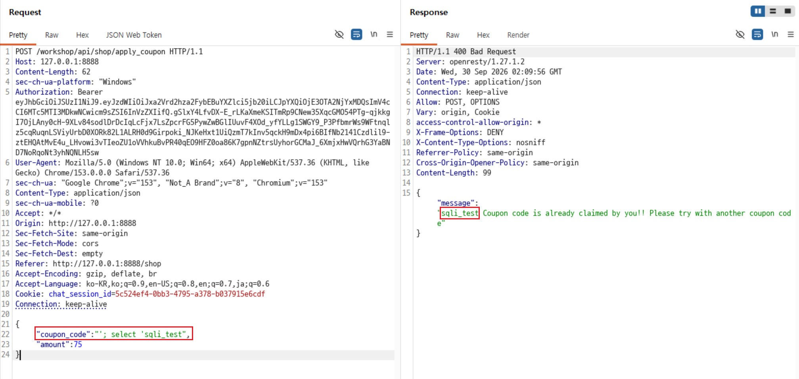

# C13. SQL Injection

## 배경 개념

- **SQL Injection:** 사용자 입력을 SQL 문에 문자열로 이어 붙일 때, 입력값에 포함된 SQL 구문이 원래 질의의 일부로 실행될 수 있는 취약점임.
- **다중 문장 실행:** 데이터베이스 드라이버와 설정이 이를 허용하면 세미콜론(`;`) 뒤에 이어진 별도 SQL 문도 실행될 수 있음.

## 관찰 과정

- 쿠폰 적용 API인 `POST /workshop/api/shop/apply_coupon`은 `coupon_code`와 `amount`를 JSON으로 받음.
- 존재하지 않는 일반 문자열 쿠폰 코드는 `Coupon not found` 응답을 반환함.
- 쿠폰 코드 문자열 안에서 SQL 문맥을 종료한 뒤 상수 `sqli_test`를 조회하는 요청을 전송할 수 있었음.
- 응답 메시지 앞부분에 `sqli_test`가 반환되어, 입력값이 SQL 문으로 해석된 사실을 확인함.

## 재현 절차 및 증적

1. 먼저 존재하지 않는 일반 쿠폰 코드를 전송해 실패 기준을 확인함.

   ```json
   {
     "coupon_code": "__NO_MATCH__",
     "amount": 75
   }
   ```

   `400 Bad Request`와 `Coupon not found`가 반환됨.

   

2. 같은 위치에 SQL 문맥을 종료하는 작은따옴표와 세미콜론을 넣고, 데이터베이스 스키마를 사용하지 않는 상수 조회를 전송함.

   ```json
   {
     "coupon_code": "'; SELECT 'sqli_test",
     "amount": 75
   }
   ```

   `400 Bad Request` 응답이지만 메시지 앞부분에 `sqli_test`가 반환됨. 일반 문자열 요청의 `Coupon not found`와 달리, 주입한 `SELECT` 문의 결과가 중복 쿠폰 확인 결과로 처리된 것을 확인함.

   

## 분석

중복 쿠폰 확인 과정에서 사용자 입력인 쿠폰 코드가 SQL 문에 문자열 결합으로 포함되었다. 전송한 값의 시작 작은따옴표는 원래 쿠폰 코드 문자열을 종료하고, 세미콜론 뒤의 `SELECT 'sqli_test'`는 별도 조회 문으로 해석되었다. 그 결과가 기존 중복 확인 결과처럼 처리되어, 응답 메시지에 `sqli_test`가 노출되었다.

이 재현은 테이블명·컬럼명·다른 사용자 데이터를 전제하지 않는다. 일반 문자열 요청과 상수 조회 요청의 응답 차이만으로 입력값이 SQL 문맥에서 해석됨을 확인했다.

### 서버 쿼리 조합 방식

이 API가 쿠폰 코드를 작은따옴표로 감싼 SQL 문자열에 연결한다고 보면, 서버가 조합하는 원래 형태는 아래와 같음. 현재 사용자 식별자는 실제 값 대신 `<current_user_id>`로 표기함.

```sql
SELECT coupon_code FROM applied_coupon
WHERE user_id = <current_user_id>
  AND coupon_code = '<입력값>';
```

전송한 `coupon_code` 값은 아래 세 부분 사이에 들어감.

```text
서버 앞부분:  ... AND coupon_code = '
사용자 입력:  '; SELECT 'sqli_test
서버 뒷부분:  '
```

따라서 최종 SQL은 다음처럼 해석됨.

```sql
SELECT coupon_code FROM applied_coupon
WHERE user_id = <current_user_id>
  AND coupon_code = '';
SELECT 'sqli_test';
```

입력 첫 글자의 작은따옴표가 원래 문자열을 닫아 빈 문자열 비교가 되고, 세미콜론이 첫 번째 문장을 끝냄. 이어지는 두 번째 `SELECT`는 상수 `sqli_test`만 반환하며, 입력값 마지막에 넣지 않은 종료 작은따옴표는 서버 뒷부분이 보완함. SQL Injection 검증에서는 이처럼 서버 앞부분·입력값·서버 뒷부분을 이어 붙여 최종 문법이 성립하는지 먼저 계산해야 함.

### SQL 문 작성 시 주의할 점

- **따옴표 경계를 먼저 확인함:** 원래 SQL 문이 입력값 앞뒤에 작은따옴표를 붙이는 구조인지 확인해야 함. 이번 요청은 서버가 입력값 뒤에 작은따옴표를 추가하므로, `sqli_test` 뒤에는 작은따옴표를 넣지 않아야 최종 SQL 문이 닫힘.
- **문자열과 JSON을 구분함:** 작은따옴표는 JSON 문자열을 감싸는 큰따옴표 안의 일반 문자임. JSON 문법을 깨지 않도록 전체 요청 본문은 큰따옴표를 유지해야 함.
- **상수로 최소 검증함:** 스키마 정보나 실제 데이터를 조회하지 않고 상수 한 개만 반환해 실행 여부를 확인함. 대량 조회·변경·삭제 구문은 사용하지 않음.
- **오류만으로 결론 내리지 않음:** `500` 오류, 구문 오류, 차단 응답만으로는 실행 여부를 확정할 수 없음. 이 사례처럼 주입한 조회 결과가 응답 필드에 반영되는지를 확인해야 함.


## 대응 방안

쿠폰 코드와 사용자 식별자는 SQL 문자열에 결합하지 말고, 준비된 쿼리(Prepared Statement) 또는 ORM의 파라미터 바인딩으로 전달해야 한다. 데이터베이스 계정은 다중 문장 실행을 허용하지 않고 필요한 최소 권한만 부여해야 한다. 또한 중복 확인 실패 응답에는 내부 조회값을 포함하지 말고 고정된 오류 메시지만 반환해야 한다.
