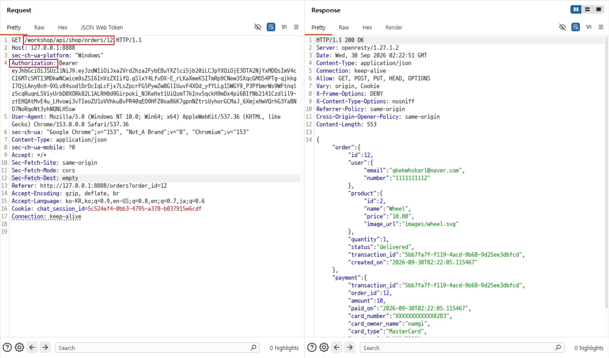
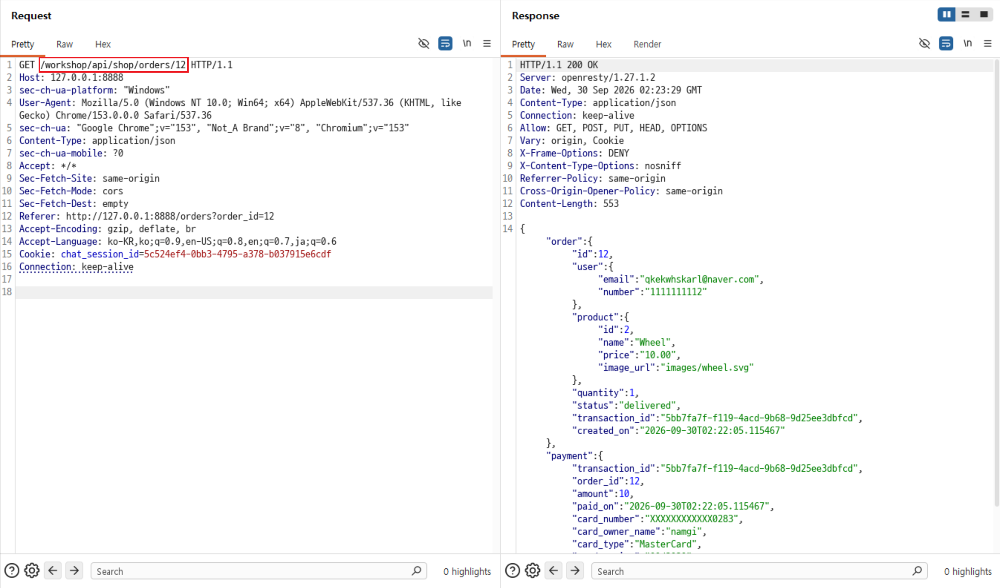

# C14. 인증 없이 주문 상세 정보 접근

## 배경 개념

- **인증(Authentication):** 요청자가 유효한 사용자 또는 시스템인지를 확인하는 과정임. 일반적으로 API는 토큰·세션·API 키 등을 검증한 뒤 보호 자원을 제공함.
- **인증 누락:** 보호해야 할 API 경로에 인증 검증이 적용되지 않으면, 로그인하지 않은 요청도 정상 사용자와 같은 데이터를 받을 수 있음.
- **객체 식별자 노출:** 인증이 빠진 상태에서 숫자형 주문 ID처럼 예측 가능한 식별자를 사용하면, 알려진 ID만으로 주문 상세 정보가 노출될 수 있음.

## 관찰 과정

- 주문 상세 조회 API는 `GET /workshop/api/shop/orders/{order_id}` 형식으로 호출됨.
- `Authorization: Bearer <JWT>` 헤더가 있는 요청에서 주문 ID `12`의 상세 정보와 결제 정보가 `200 OK`로 반환됨.
- 동일한 요청에서 `Authorization` 헤더를 제거해도 같은 주문 정보가 `200 OK`로 반환됨.
- 인증 헤더가 없는 요청의 응답에도 이메일, 전화번호, 상품, 수량, 주문 상태 및 결제 정보가 포함됨.

## 재현 절차 및 증적

1. 로그인 상태에서 주문 ID `12`를 조회함.

   ```http
   GET /workshop/api/shop/orders/12 HTTP/1.1
   Authorization: Bearer <JWT>
   ```

   인증 헤더가 포함된 요청에서 주문 및 결제 정보가 `200 OK`로 반환됨.

   

2. 동일한 요청에서 `Authorization` 헤더를 제거하고 다시 전송함.

   ```http
   GET /workshop/api/shop/orders/12 HTTP/1.1
   ```

   인증 헤더가 없지만 동일하게 `200 OK`가 반환됐고, 주문 객체와 결제 정보를 확인함.

   

## 분석

동일한 주문 ID에 대해 JWT가 있는 요청과 없는 요청의 응답 상태와 데이터가 동일했다. 주문 상세 조회 API는 보호 자원을 반환하기 전에 요청자의 인증 정보를 확인하지 않는 것으로 판단할 수 있다.

응답에는 주문 정보뿐 아니라 사용자 이메일·전화번호와 결제 관련 정보가 함께 포함됐다. 주문 ID가 외부에 노출되거나 추측 가능하다면, 인증되지 않은 제3자가 해당 주문의 상세 정보를 조회할 위험이 있다.

## 대응 방안

모든 주문 조회 API에 공통 인증 미들웨어를 적용하고, 인증 정보가 없거나 유효하지 않으면 `401 Unauthorized`를 반환해야 한다. 인증 이후에는 주문의 소유자 또는 허가된 역할인지 객체 단위 권한 검사를 추가해야 한다. 응답에서는 결제 정보와 개인정보를 최소화하고, 상세 주문 조회를 인증 없이 반복 호출하는 행위를 모니터링·차단해야 한다.
