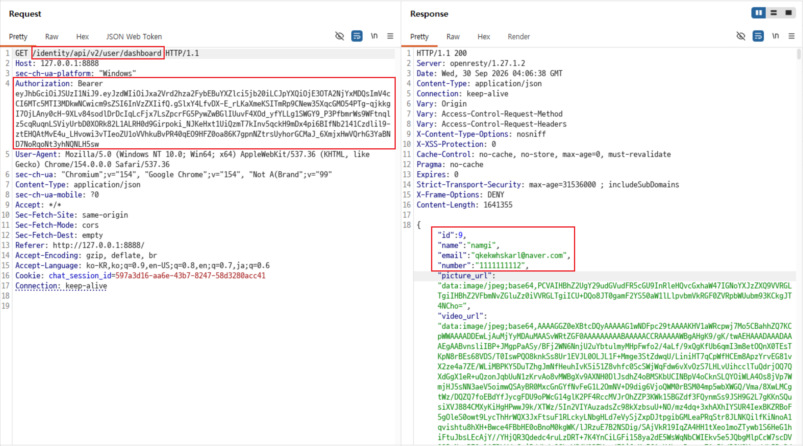
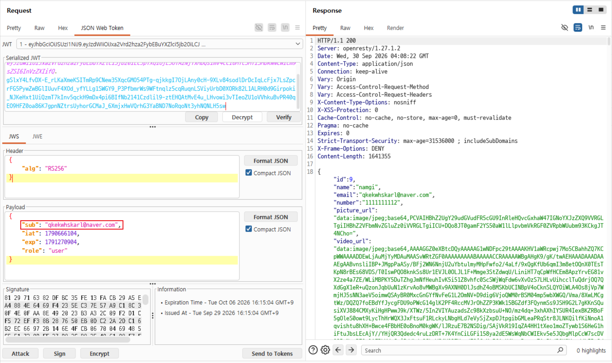
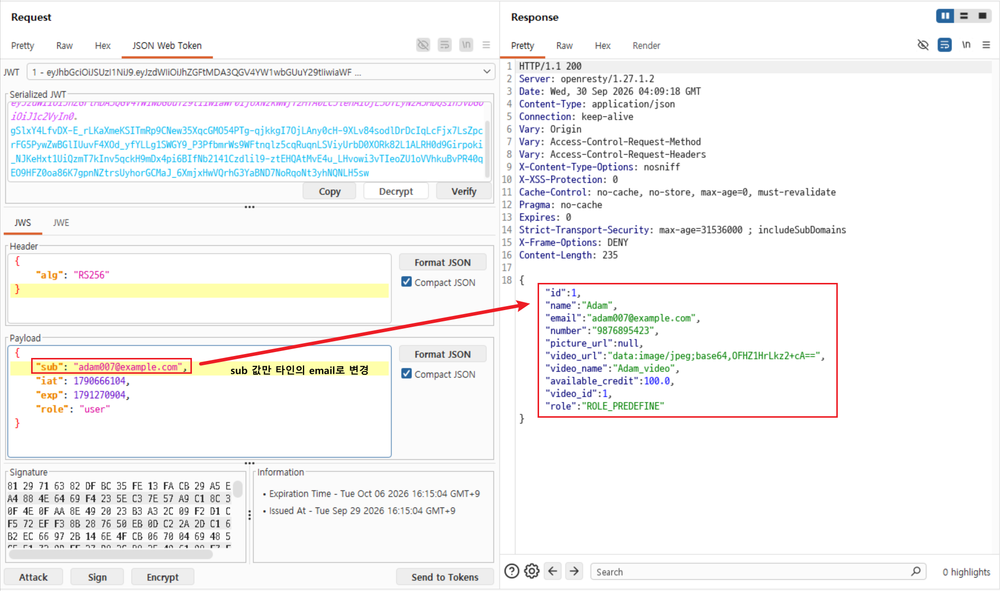

# C15. JWT 서명 검증 누락으로 타 계정 대시보드 조회

## 배경 개념

- **JWT 구조:** JWT는 `Header.Payload.Signature` 세 부분으로 구성됨. Payload에는 사용자 식별자 같은 클레임이 포함될 수 있음.
- **서명 검증:** 서버는 Header와 Payload가 발급 이후 변조되지 않았는지 Signature로 검증한 뒤에만 클레임을 신뢰해야 함.
- **`sub` 클레임:** `sub`는 토큰 주체를 식별하는 표준 클레임임. API가 이를 사용자 조회 기준으로 사용하면 변조 여부 검증이 필수임.

## 관찰 과정

- 원래 JWT는 Header의 `alg` 값이 `RS256`이고, Payload의 `sub`가 현재 계정 이메일로 설정되어 있었음.
- 원래 JWT로 `GET /identity/api/v2/user/dashboard`를 호출하자 현재 계정 `namgi`의 대시보드 정보가 반환됨.
- JWT Editor에서 서명을 새로 생성하지 않고 Payload의 `sub`만 `adam007@example.com`으로 변경함.
- 변경된 토큰으로 같은 대시보드 API를 호출하자 Adam 계정의 이름, 이메일, 전화번호, 크레딧 및 프로필 정보가 `200 OK`로 반환됨.

## 재현 절차 및 증적

1. 원래 JWT를 포함해 `GET /identity/api/v2/user/dashboard`를 호출함. 응답에서 현재 계정 `namgi`와 이메일이 반환됨.

   

2. JWT Editor에서 원래 토큰의 Payload를 확인함. Header는 `RS256`이며, `sub`에는 현재 계정 이메일이 설정되어 있었음.

   

3. Header와 기존 Signature는 유지한 채 Payload의 `sub`만 `adam007@example.com`으로 변경하고, 같은 대시보드 API를 호출함.

   ```json
   {
     "sub": "adam007@example.com"
   }
   ```

   `200 OK` 응답에서 Adam 계정의 ID `1`, 이름, 이메일, 전화번호, 크레딧 및 역할 정보가 반환됨.

   

## 분석

JWT의 Signature는 Header와 Payload를 대상으로 생성되므로, Payload의 `sub`를 수정하면 기존 Signature는 더 이상 유효하지 않아야 한다. 그러나 변조된 토큰으로 다른 계정의 대시보드 정보가 반환됐으므로, 이 API는 Signature 검증 전에 `sub` 클레임을 신뢰한 것으로 판단할 수 있다.

이 토큰은 암호학적으로 유효하게 다시 서명된 토큰이 아니다. 그럼에도 서버가 Payload의 사용자 식별자를 그대로 사용했기 때문에, 공격자는 서명 키 없이 임의 계정의 식별자로 토큰을 변조할 수 있다.

## 대응 방안

모든 보호 API는 JWT Payload를 사용하기 전에 Signature를 반드시 검증해야 한다. 발급 시 허용한 알고리즘과 공개키를 고정하고, `alg` 값이 클라이언트 입력에 따라 검증 방식을 바꾸지 않도록 해야 한다. 또한 만료 시간, 발급자, 대상자 등의 클레임도 함께 검증하고, Signature 검증에 실패한 토큰은 어떤 사용자 조회에도 사용하지 않고 `401 Unauthorized`로 거부해야 한다.
