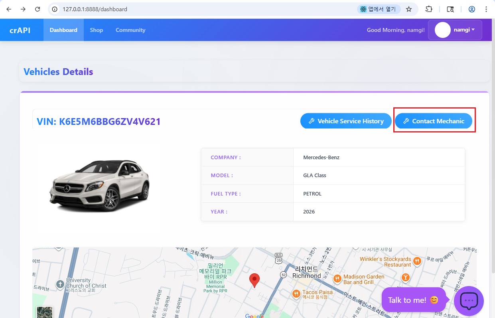
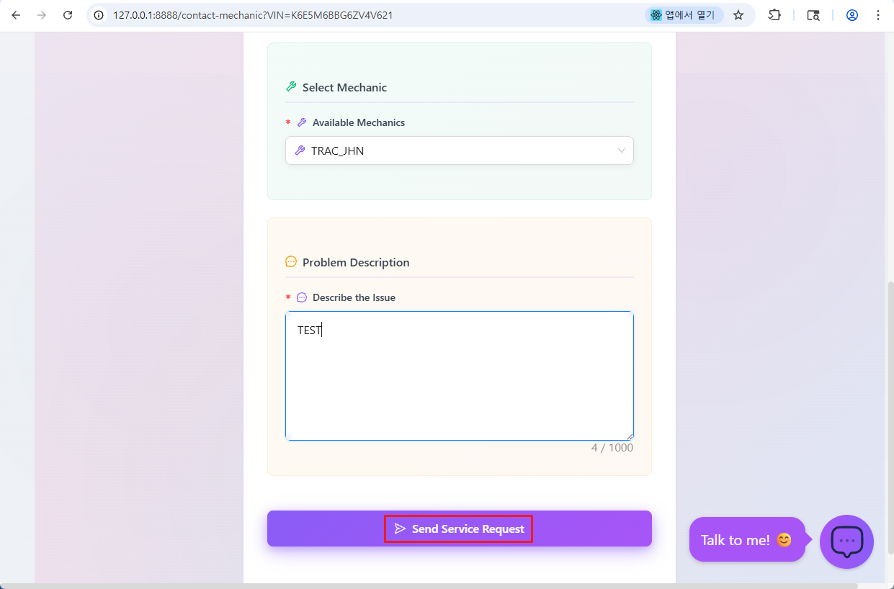
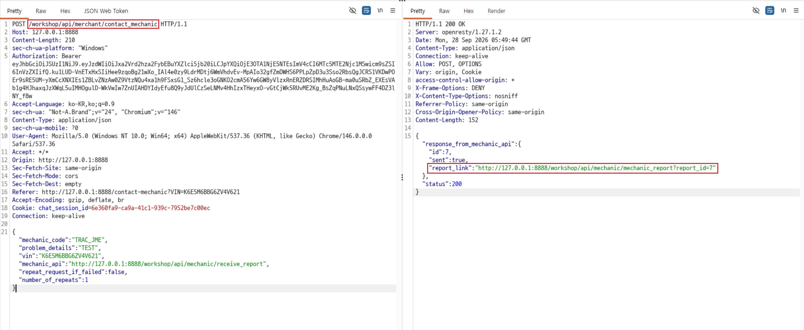
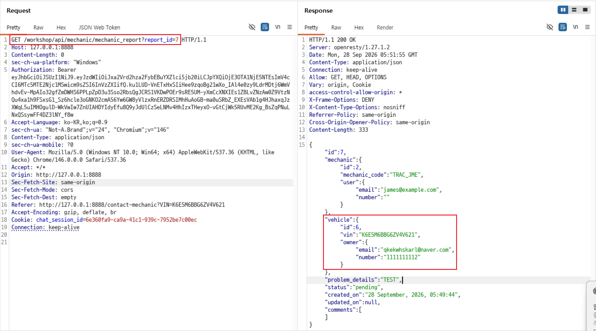
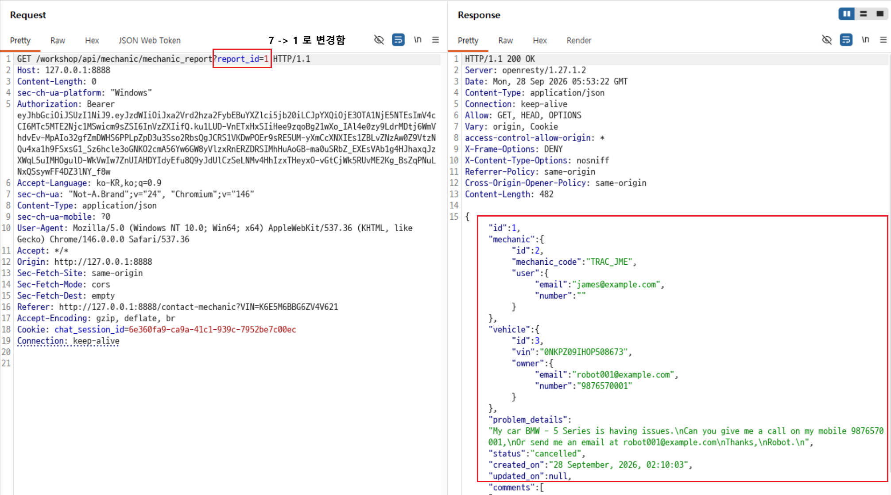

# C2. 타 사용자의 정비 보고서 조회

## 배경 개념

- **BOLA (Broken Object Level Authorization, 객체 수준 권한 부여 오류):** 로그인 여부를 확인하더라도, 요청한 보고서가 로그인한 사용자의 것인지 확인하지 않으면 다른 사용자의 객체에 접근할 수 있음.

## 관찰 과정

- 차량 상세 화면에서 Contact Mechanic 기능으로 정비 요청을 제출했다.
- `POST /workshop/api/merchant/contact_mechanic` 응답에서 `id: 7`과 `report_link`의 `report_id=7`을 확인했다.
- 같은 Bearer 토큰으로 `GET /workshop/api/mechanic/mechanic_report?report_id=7`을 요청해 본인 차량 소유자 정보와 정비 내용을 확인했다.
- 같은 토큰을 유지하고 `report_id`를 `1`로 변경하자 `200 OK`와 다른 계정 소유 차량의 VIN, 연락처 및 정비 내용이 반환됐다.

## 재현 절차 및 증적

1. 로그인한 계정의 차량 상세 화면에서 Contact Mechanic을 선택함.

   

2. 정비사를 선택하고 테스트용 문제 내용을 입력한 뒤 정비 요청을 제출함.

   

3. Burp에서 `POST /workshop/api/merchant/contact_mechanic`의 응답을 확인하고, `report_link`와 `report_id=7`을 기록함.

   

4. Repeater에서 `report_link`의 GET 요청을 보내고, 같은 인증 토큰으로 본인 보고서의 기준 응답을 확인함.

   

5. 인증 토큰은 유지하고 `report_id=7`을 `report_id=1`로 변경해 요청함.
6. `200 OK`와 다른 사용자 소유 차량의 보고서 데이터가 반환되는 것을 확인함.

   

## 분석

보고서 조회 API는 Bearer 토큰이 있는 요청을 처리했지만, 요청한 보고서의 소유자와 로그인한 사용자가 같은지 확인하지 않았다. 동일한 토큰으로 본인 보고서 `7`과 다른 사용자 보고서 `1`을 모두 조회했고, 두 번째 응답에는 다른 소유자의 이메일·전화번호, 차량 VIN, 문제 내용이 포함됐다. 객체별 인가 검사가 누락된 BOLA 사례다.

현재 증적은 인증된 계정이 다른 사용자의 보고서에 접근할 수 있음을 입증한다. 인증 헤더가 없는 요청의 허용 여부는 별도로 확인하지 않았다.

## 대응 방안

두 계정으로 각각 정비 보고서를 만들고, 계정 A의 인증 상태에서 계정 B의 `report_id`를 요청해 권한 검사를 확인한다. 서버는 매 요청에서 보고서와 로그인 사용자 간의 소유 관계 또는 역할 기반 접근 권한을 검사해야 한다. ID가 숫자이거나 추측하기 쉬운지는 보조 조건이며, 접근 통제는 ID를 알기 어렵게 만드는 방식에 의존하면 안 된다.

공식 과제: [OWASP crAPI Challenge 2](https://github.com/OWASP/crAPI/blob/develop/docs/challenges.md#challenge-2---access-mechanic-reports-of-other-users)
