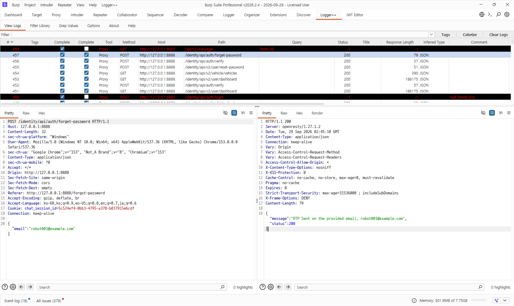
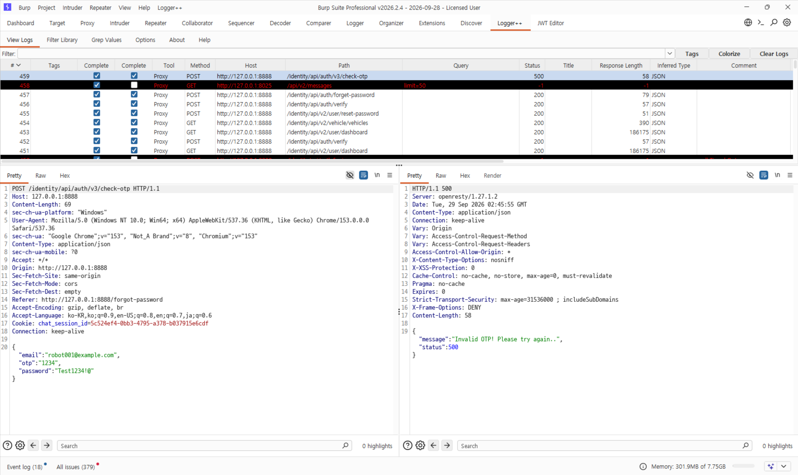
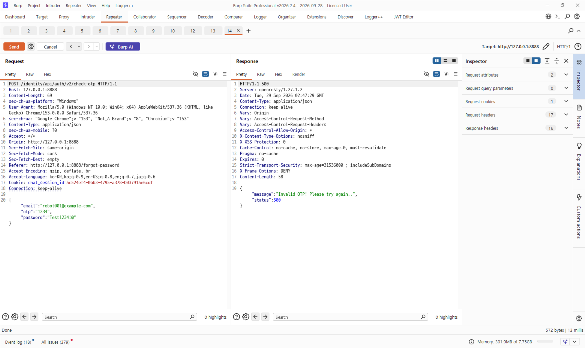
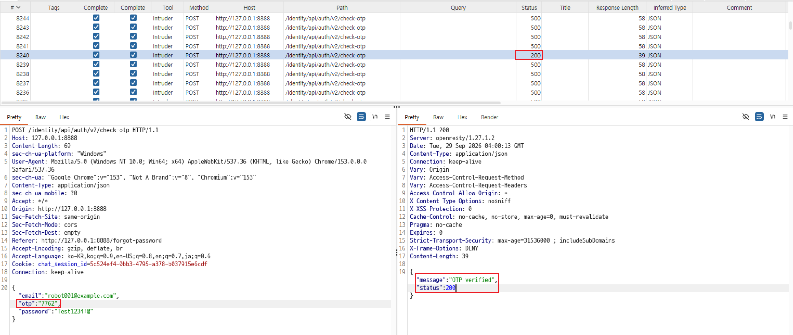
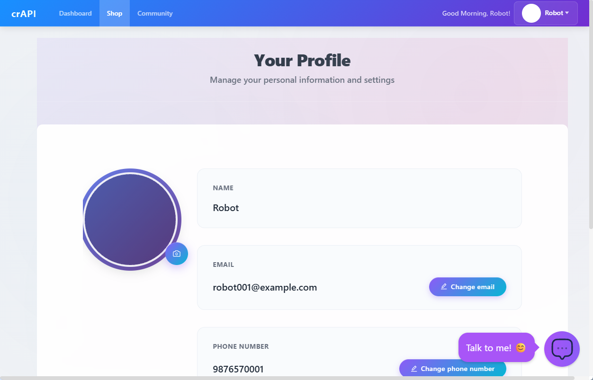

# C3. 타 사용자의 비밀번호 재설정

## 배경 개념

- **구버전 API 노출:** 화면이 최신 경로를 사용하더라도 유사한 구버전 API가 남아 있으면, 약한 보호 정책을 가진 경로로 같은 기능을 호출할 수 있음.

## 관찰 과정

- 포럼에서 다른 테스트 계정의 이메일을 확인했다.
- `POST /identity/api/auth/forget-password` 요청에 해당 이메일을 넣자 OTP 발송 성공 응답이 반환됐다.
- 화면은 OTP 검증에 `/identity/api/auth/v3/check-otp`를 사용했다. 잘못된 OTP를 보냈을 때 `500`과 `Invalid OTP`가 반환됐다.
- 같은 본문을 `/identity/api/auth/v2/check-otp`로 보내는 요청을 Intruder에서 실행했다. Intruder 요청 중 하나가 `200 OK`와 `OTP verified`를 반환했고, 성공 요청의 OTP는 `7762`였다.
- 새 비밀번호를 설정한 뒤 해당 계정으로 다시 로그인해 Robot 프로필을 확인했다.

## 재현 절차 및 증적

1. 포럼에서 다른 테스트 계정의 이메일을 확인함. 이메일은 `robot001@example.com`이었음.
2. 로그인 화면에서 Forgot Password를 열고 해당 이메일로 재설정 요청을 보냄. Burp에서 OTP 발송 성공 응답을 확인함.

   

3. 화면이 호출한 `/identity/api/auth/v3/check-otp` 요청을 확인하고, 잘못된 코드 `1234`를 보냈을 때의 실패 응답을 기록함.

   

4. 요청 본문을 유지하고 경로를 `/identity/api/auth/v2/check-otp`로 바꿔 Repeater에서 전송함. 같은 잘못된 코드에 대해 `Invalid OTP` 응답이 반환됨.

   

5. v2 요청을 Intruder에서 실행해 OTP 후보를 순차로 대입함. `200 OK`와 `OTP verified`가 반환된 성공 요청에서 `otp=7762`를 확인함.

   

6. 성공한 OTP와 새 비밀번호로 계정에 로그인하고 Robot 프로필을 확인함.

   

## 분석

비밀번호 재설정 기능은 이메일에 발송된 4자리 OTP를 확인한 뒤 새 비밀번호를 설정한다. 화면이 사용하는 v3 경로와 별도로 호출 가능한 v2 경로가 남아 있었고, Intruder를 통한 OTP 후보 요청 중 성공 값이 확인됐다. 성공 응답 뒤 새 비밀번호로 대상 계정에 로그인할 수 있었다. 따라서 계정 이메일을 알아낸 공격자는 OTP 검증 취약 경로를 이용해 다른 사용자의 비밀번호를 재설정하고 계정을 탈취할 수 있다.

## 대응 방안

OTP는 충분한 길이와 예측 불가능성을 갖춰야 하며, 재설정 코드는 짧은 유효 기간과 제한된 시도 횟수를 적용해야 한다. 제한은 화면에서 사용하는 API뿐 아니라 같은 기능을 제공하는 모든 버전과 경로에 일관되게 적용하고, 제한 초과 시 코드를 폐기해야 한다. 비밀번호 재설정 성공 후에는 기존 세션도 무효화하는 것이 바람직하다.

공식 과제: [OWASP crAPI Challenge 3](https://github.com/OWASP/crAPI/blob/develop/docs/challenges.md#challenge-3---reset-the-password-of-a-different-user)
