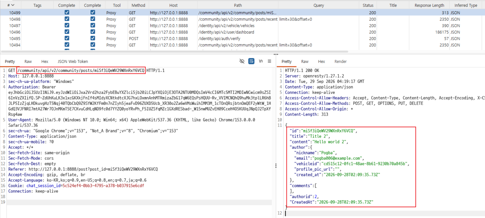

# C4. 다른 사용자의 민감 정보가 노출되는 API

## 배경 개념

- **과도한 데이터 노출 (Excessive Data Exposure):** API가 기능에 필요한 범위를 넘어 민감하거나 내부적인 데이터를 응답에 포함해, 클라이언트에 전달하는 문제임.
- **데이터 최소화:** API 응답에는 화면과 기능에 필요한 속성만 포함해야 함. 화면에서 숨기거나 사용하지 않는 값도 응답에 있으면 브라우저 개발자 도구나 프록시에서 확인할 수 있음.

## 관찰 과정

- 사용자 계정으로 로그인한 상태에서 Community 화면을 열고 Pogba의 게시글을 조회했다.
- 게시글을 불러오는 `GET /community/api/v2/community/posts/{postId}` 요청은 `200 OK`를 반환했다.
- 응답의 `author` 객체에는 화면에 표시되는 별명 외에 작성자의 이메일과 `vehicleid`가 포함돼 있었다.
- 로그인 계정과 게시글 작성자가 서로 다른 것을 확인했다.

## 재현 절차 및 증적

1. 테스트 계정으로 로그인하고 Community에서 다른 사용자인 Pogba의 게시글을 엶.

3. 응답 JSON의 `author` 객체에 `email`과 `vehicleid`가 포함된 것을 확인함.

   

## 분석

게시글 조회 기능은 게시글 내용과 작성자 별명을 표시하는 데 필요한 범위를 넘어 작성자의 이메일과 차량 ID까지 응답했다. 로그인한 사용자가 다른 사용자의 게시글을 정상적으로 열기만 해도 해당 필드를 확인할 수 있으므로, 민감 정보가 API 응답에 불필요하게 포함되는 과도한 데이터 노출 사례다.

## 대응 방안

게시글 응답용 모델에서 이메일과 차량 ID처럼 공개할 필요가 없는 필드를 제외해야 한다. 응답 직렬화 단계에서 허용된 필드만 명시하고, 사용자의 화면에서 실제로 사용하지 않는 필드가 API 응답에 포함되지 않는지 검증한다.

공식 과제: [OWASP crAPI Challenge 4](https://github.com/OWASP/crAPI/blob/develop/docs/challenges.md#challenge-4---find-an-api-endpoint-that-leaks-sensitive-information-of-other-users)
