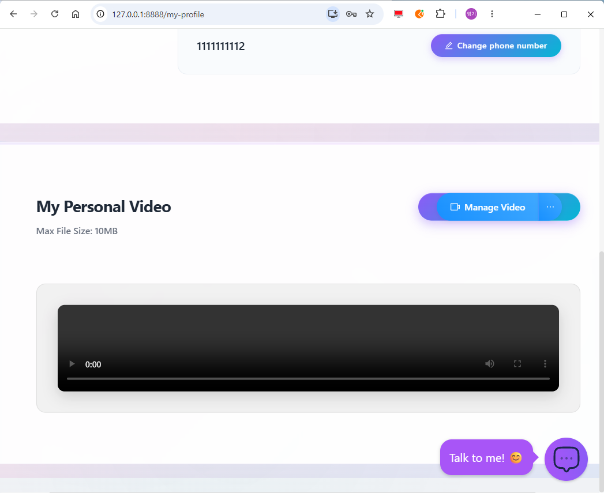
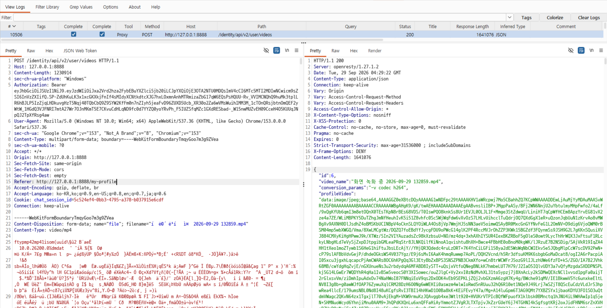
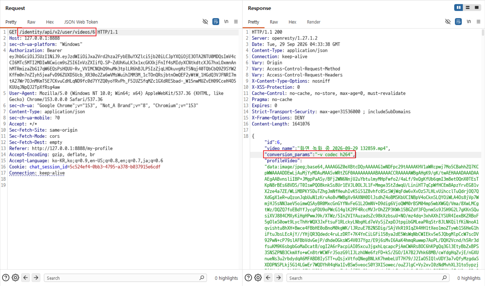

# C5. 동영상 API에서 내부 속성 찾기

## 배경 개념

- **내부 속성 노출:** API가 사용자 기능에 필요한 정보뿐 아니라 서버의 내부 처리 방식이나 관리용 속성까지 응답에 포함하는 문제임.
- **데이터 최소화:** 클라이언트가 사용하지 않는 내부 메타데이터는 응답에서 제외해야 함. 응답에 포함된 값은 인증된 사용자가 프록시를 통해 직접 확인할 수 있음.

## 관찰 과정

- Profile에서 개인 동영상을 업로드하고, Burp Proxy에서 업로드 요청과 응답을 확인한다.
- `POST /identity/api/v2/user/videos` 응답은 영상 ID와 함께 `conversion_params` 필드를 반환한다.
- 해당 영상의 `GET /identity/api/v2/user/videos/{video_id}` 응답에서도 같은 필드가 확인된다.
- `conversion_params` 값은 `-v codec h264`이며, 별도의 속성 변경이나 변환 실행 없이 응답에서 읽히는 것만 확인한다.

## 재현 절차 및 증적

1. 일반 사용자로 로그인 후 Profile의 `My Personal Video` 영역에서 테스트 동영상을 업로드함.

   

3. 응답 JSON에서 영상 코덱인 `conversion_params: "-v codec h264"`가 반환되는 것을 확인함.

   

5. 영상 재생 후 응답에 동일한 `conversion_params`가 반환되는 것을 확인함.

   

## 분석

동영상 관리 API가 요청에 지정된 프로필 동영상 정보를 반환하면서 변환 설정인 `conversion_params`까지 사용자에게 노출한다. 코덱 설정 자체가 인증 정보나 비밀 값이라는 뜻은 아니다. 문제는 사용자 기능에 필요하지 않은 서버 내부 처리 속성이 응답 모델에 포함된다는 점이며, 이 정보는 이후 내부 속성 변경 가능성을 조사할 단서가 될 수 있다.

## 대응 방안

동영상 API 응답에는 클라이언트가 이후 동작에 필요한 식별자와 허용된 표시 정보만 포함하고, 변환 옵션과 같은 내부 처리 속성은 제외해야 한다. 요청·응답 DTO를 분리하고 응답 직렬화 필드를 허용 목록으로 제한하면 내부 모델의 속성이 실수로 외부에 노출되는 것을 줄일 수 있다.
