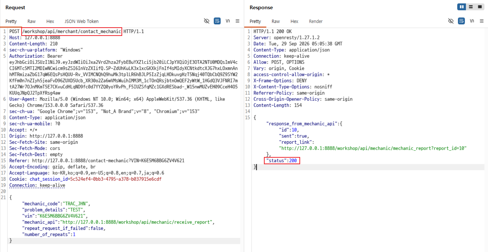
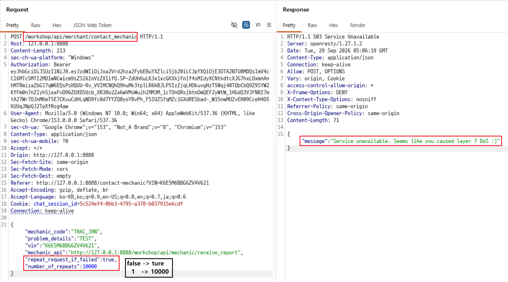

# C6. Layer 7 DoS

## 배경 개념

- **Layer 7 DoS:** 웹 애플리케이션의 정상 기능을 악용해 서버 자원을 과도하게 소비시키고, 서비스 응답을 지연하거나 사용할 수 없게 만드는 공격임.
- **제한 없는 리소스 소비:** 서버가 클라이언트가 전달한 반복 횟수나 재시도 여부를 검증하지 않으면, 적은 수의 요청으로도 서버가 과도한 내부 작업을 수행할 수 있음.

## 관찰 과정

- Contact Mechanic 기능은 `POST /workshop/api/merchant/contact_mechanic` 요청으로 정비 보고서를 전달함.
- 요청 본문에는 재시도 여부를 결정하는 `repeat_request_if_failed`와 반복 횟수인 `number_of_repeats`가 포함됨.
- 기본값 `false`, `1`로 전송한 요청은 `200 OK`와 정비사 API 전송 성공 응답을 반환함.
- 두 값을 `true`, `10000`으로 변경한 요청은 `503 Service Unavailable`과 Layer 7 DoS 메시지를 반환함.

## 재현 절차 및 증적

1. 로그인한 계정으로 Contact Mechanic 요청을 전송하고, 기본값 `repeat_request_if_failed: false`, `number_of_repeats: 1`에서 `200 OK`와 정비 보고서 전송 성공 응답을 확인함.

   

2. Repeater에서 동일 요청의 `repeat_request_if_failed`를 `true`로, `number_of_repeats`를 `10000`으로 변경 및 전송 후  `503 Service Unavailable`과 `Service unavailable. Seems like you caused layer 7 DoS :)` 메시지가 반환되는 것을 확인함.

   

## 분석

서버는 재시도 여부와 반복 횟수를 클라이언트 입력으로 받아 처리했다. 정상 요청은 한 번의 정비사 API 호출로 완료되지만, 재시도를 활성화하고 반복 횟수를 크게 설정하면 서버가 내부 호출을 과도하게 수행한다. 이로 인해 서비스가 요청을 처리할 수 없는 상태가 되어 `503` 응답을 반환했다. 

## 대응 방안

서버에서 재시도 횟수의 상한을 강제하고, 클라이언트가 재시도 여부와 횟수를 직접 지정하지 못하도록 해야 한다. 재시도는 서버가 정한 짧은 횟수와 지수 백오프 정책으로 관리하며, 사용자·IP·기능 단위의 요청 제한을 적용한다. 반복 호출이 감지되면 작업을 중단하고, 큐의 길이와 오류율을 모니터링해 서비스 저하 전에 차단한다.
