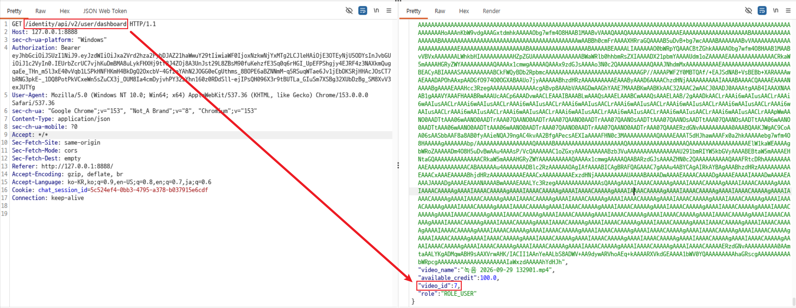
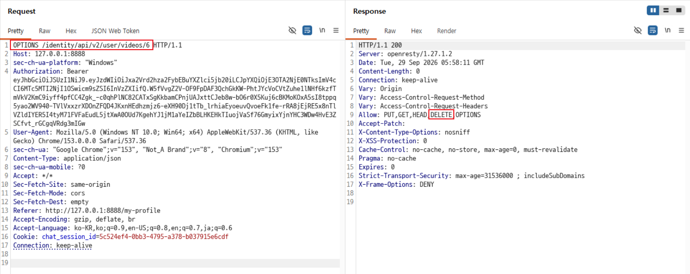
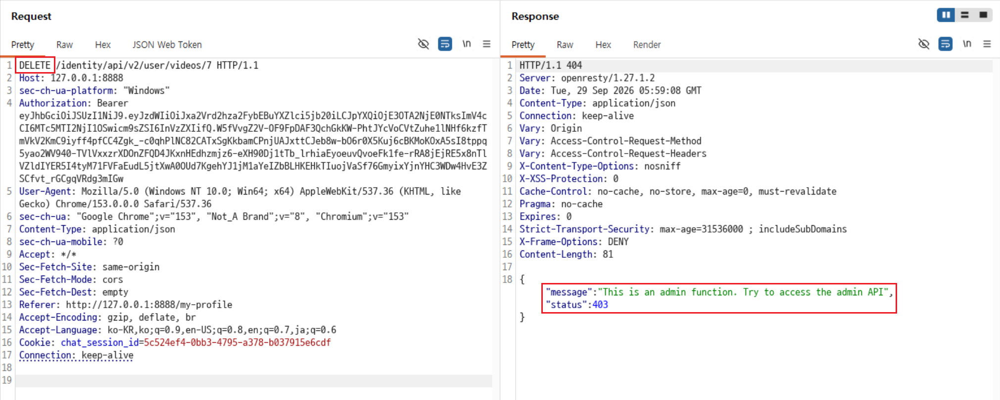
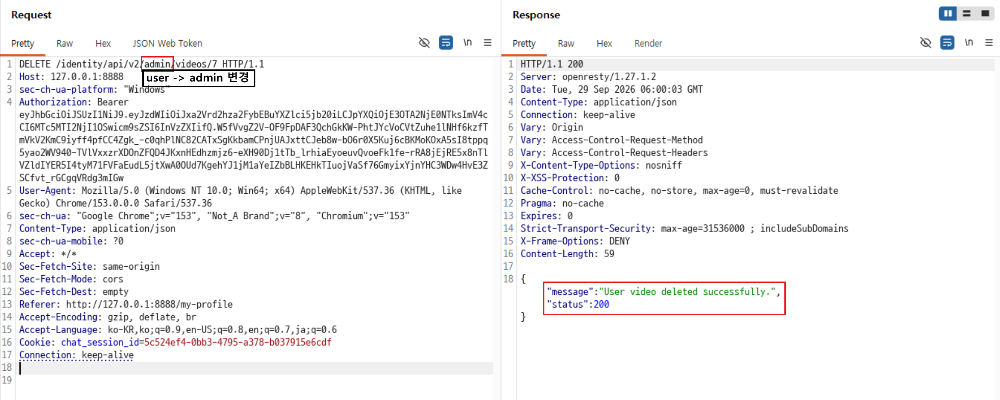
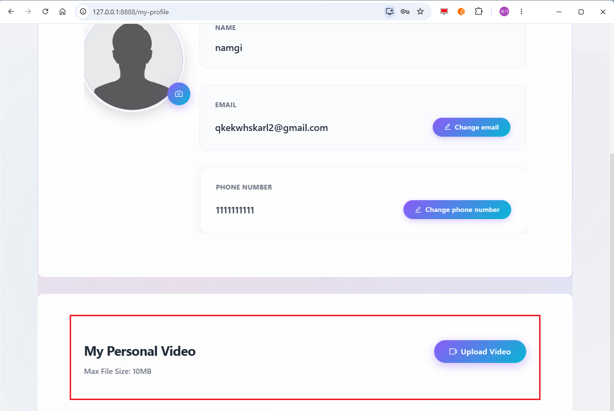

# C7. 다른 사용자의 동영상 삭제

## 배경 개념

- **BFLA(Broken Function Level Authorization):** 일반 사용자와 관리자가 수행할 수 있는 기능을 서버가 구분하지 않아, 권한이 없는 사용자가 관리자 기능을 호출할 수 있는 취약점임.
- **기능 수준 권한 검증:** 관리자용 API는 경로 이름만으로 분리해서는 안 되며, 요청을 처리하는 서버에서 인증된 사용자의 역할과 권한을 검증해야 함.

## 관찰 과정

- 대상 테스트 계정의 대시보드 응답에서 등록된 동영상의 `video_id`가 `7`임을 확인함.
- 동영상 API의 `OPTIONS` 응답에는 `DELETE` 메서드가 허용되어 있었음.
- 일반 사용자 경로인 `/identity/api/v2/user/videos/7`에 `DELETE` 요청을 전송하자, 응답 본문에서 관리자 기능과 관리자 API 사용을 안내함.
- 다른 테스트 계정의 Bearer 토큰을 유지한 채 경로의 `user`를 `admin`으로 변경하자 동영상 삭제가 성공함.
- 대상 계정의 프로필에서 재로그인 후 기존 동영상 플레이어가 사라지고 업로드 버튼만 표시되는 것을 확인함.

## 재현 절차 및 증적

1. 대상 테스트 계정으로 `GET /identity/api/v2/user/dashboard`를 요청하여, 응답의 `video_id: 7`을 확인함.

   

2. `OPTIONS /identity/api/v2/user/videos/6` 요청을 전송하여 `Allow` 헤더에 `DELETE`가 포함된 것을 확인함.

   

3. 다른 테스트 계정의 Bearer 토큰으로 `DELETE /identity/api/v2/user/videos/7` 요청을 전송함. HTTP 응답은 `404`였으나 본문의 `status` 값은 `403`이며, 관리자 기능과 관리자 API 사용을 안내하는 메시지가 반환됨.

   

4. Bearer 토큰은 그대로 유지하고 경로만 `DELETE /identity/api/v2/admin/videos/7`로 변경하여 전송함. `200 OK`와 `User video deleted successfully.` 응답을 확인함.

   

5. 대상 테스트 계정으로 전환한 뒤 프로필을 확인하여 기존 동영상이 사라지고 `Upload Video` 버튼만 표시되는 것을 확인함.

   

## 분석

동영상 삭제 기능은 일반 사용자 경로에서 관리자 경로를 알려 주었고, 경로만 `admin`으로 변경한 요청을 별도의 역할 검증 없이 처리했다. 그 결과 다른 테스트 계정의 동영상 식별자 `7`을 알고 있는 사용자가 관리자 전용 삭제 기능을 호출할 수 있었다. 이는 URL 경로로 기능을 구분했을 뿐, 서버 측에서 해당 기능을 호출할 역할 권한을 검증하지 않은 BFLA에 해당한다.

## 대응 방안

관리자 전용 API는 모든 요청에서 인증된 사용자의 역할과 권한을 서버 측 미들웨어 또는 정책 계층에서 검증해야 한다. 관리자 경로의 존재나 동작을 일반 사용자에게 상세히 안내하지 않고, 권한이 없는 요청에는 일관된 오류만 반환한다. 또한 동영상 삭제처럼 영향이 큰 기능은 역할 검증과 함께 대상 리소스의 소유권 또는 관리 범위를 확인하고, 일반 사용자 토큰으로 관리자 API를 호출하는 음성 테스트를 배포 전 자동화해야 한다.
