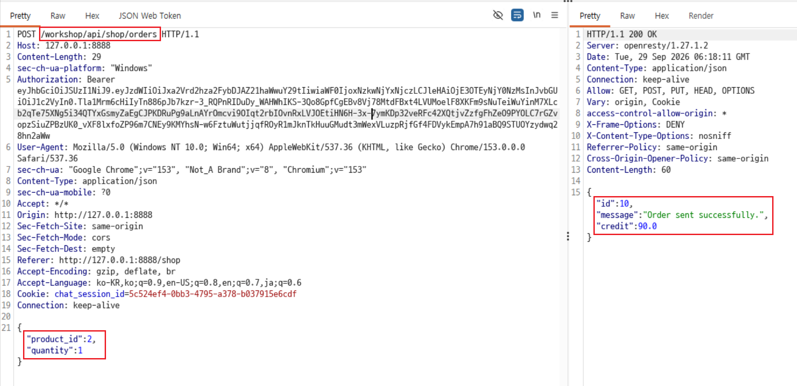
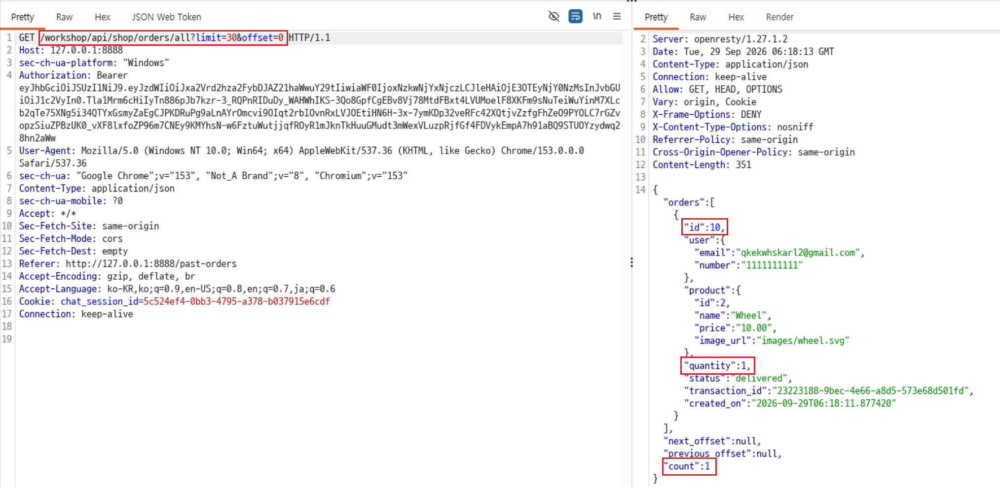
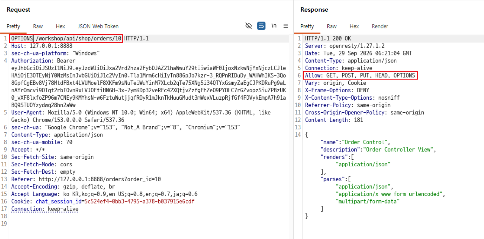
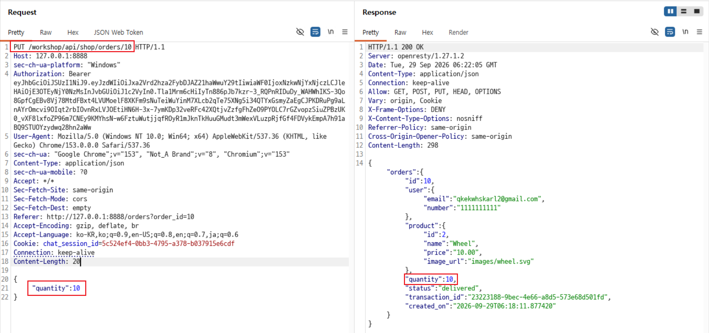
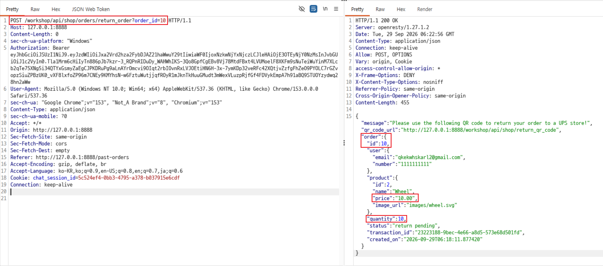
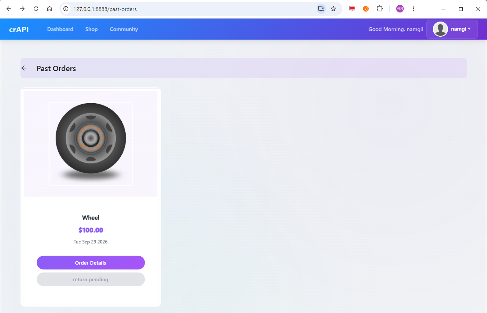

# C8. 주문 및 반품 조작 요청

## 배경 개념

- **Mass Assignment:** 클라이언트가 보낸 필드를 객체 속성에 일괄 반영하면서, 수정하면 안 되는 속성까지 변경되는 취약점임.
- **주문 무결성:** 결제 완료된 주문의 수량과 금액은 클라이언트 입력으로 변경할 수 없어야 하며, 반품·환불은 원결제 기록 및 실제 반품 수량을 기준으로 처리해야 함.

## 관찰 과정

- Shop의 주문 생성 API는 상품 ID와 수량을 받아 주문을 생성하고, 수량 `1`의 상품 주문에 대해 크레딧 `10`이 차감됨.
- 주문 목록 API에서 생성된 주문 ID `10`과 원래 수량 `1`을 확인함.
- 주문 상세 API의 `OPTIONS` 응답에서 `PUT` 메서드가 허용된 것을 확인함.
- 같은 주문에 `quantity: 10`을 포함한 `PUT` 요청을 전송하자, 추가 결제 없이 주문 수량이 `10`으로 변경됨.
- 변경된 주문을 반품 처리하자 서버는 수량 `10`, 상태 `return pending`, QR 코드 URL을 포함한 반품 요청을 생성함. 화면에서도 반품 대기 주문 금액이 `$100.00`으로 표시됨.

## 재현 절차 및 증적

1. `POST /workshop/api/shop/orders` 요청으로 상품 ID `2`, 수량 `1`로 주문함. 응답에서 주문 ID `10`과 주문 후 크레딧 `90.0`을 확인함.

   

2. `GET /workshop/api/shop/orders/all?limit=30&offset=0` 요청으로 주문 ID `10`의 원래 수량이 `1`이고 상태가 `delivered`인 것을 확인함.

   

3. `OPTIONS /workshop/api/shop/orders/10` 요청을 전송하여 `Allow` 헤더에 `PUT`이 포함된 것을 확인함.

   

4. `PUT /workshop/api/shop/orders/10` 요청 본문에 `{"quantity": 10}`을 전송함. 응답의 주문 수량이 `10`으로 변경된 것을 확인함.

   

5. `POST /workshop/api/shop/orders/return_order?order_id=10` 요청을 전송함. 응답에서 QR 코드 URL, 주문 수량 `10`, 상태 `return pending`을 확인함.

   

6. Past Orders 화면에서 상품 1개를 주문했음에도 반품 대기 주문 금액이 `$100.00`으로 표시되는 것을 확인함.

   

## 분석

서버는 결제가 완료된 주문의 `quantity`를 클라이언트가 보낸 `PUT` 본문으로 변경할 수 있게 했다. 수량 변경 시 최초 결제 금액을 다시 계산하거나 추가 결제를 요구하지 않았고, 이후 반품 요청은 조작된 수량을 그대로 사용했다. 그 결과 실제로는 1개만 구매한 상품이 10개 반품 대상, 즉 `$100.00` 반품 대기 주문으로 처리되었다. 이는 수정 가능한 필드를 제한하지 않아 발생한 Mass Assignment 취약점이다.

## 대응 방안

주문 생성 후 `quantity`, 상품, 가격, 결제 금액, 상태처럼 금전 처리에 영향을 주는 필드는 일반 사용자 수정 API에서 제외해야 한다. API 요청은 허용 목록 기반 DTO 또는 스키마로 검증하고, 주문 변경이 필요한 경우 배송 전 상태에서만 별도의 업무 규칙을 적용해야 한다. 반품·환불 처리 시에는 요청 본문이나 변경된 주문 속성이 아닌 불변 결제 기록, 배송 기록, 실제 검수 수량을 기준으로 금액을 산정해야 한다.
