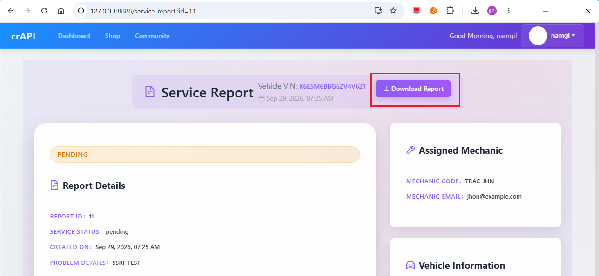
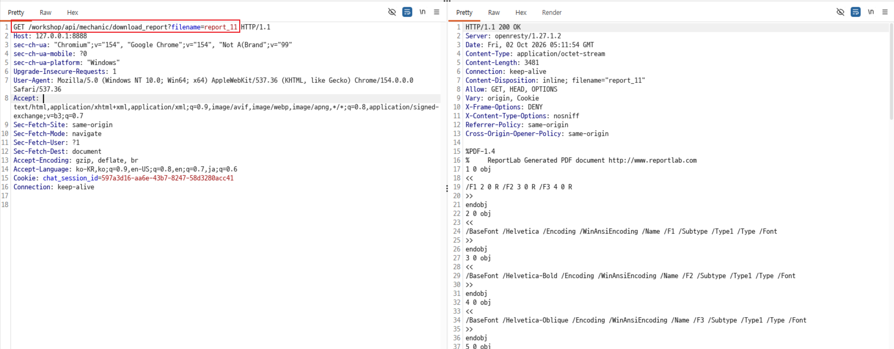
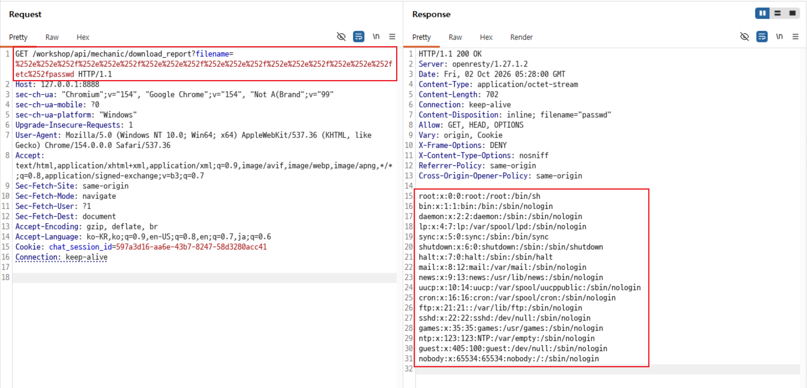

# Secret 1. **Path Traversal**

## 배경 개념

- **경로 순회(Path Traversal):** 파일명을 받는 기능에서 `../` 등의 상대 경로를 적절히 차단하지 않으면, 애플리케이션이 의도한 다운로드 디렉터리 밖의 파일을 읽을 수 있는 취약점임.
- URL 인코딩과 디코딩이 여러 단계에서 처리될 때, 검증 시점과 실제 파일 경로 해석 시점의 값이 달라질 수 있음.

## 관찰 과정

- Service Report 화면에 `Download Report` 기능이 노출됨.
- 정상 다운로드 요청에서 `GET /workshop/api/mechanic/download_report?filename=report_11` 형식과 `report_11` 파일명이 확인됨.
- 동일한 `filename` 파라미터에 이중 URL 인코딩한 상대 경로를 입력하자, 정상 보고서가 아닌 `passwd` 파일명이 포함된 응답이 반환됨.
- 확인 범위는 로그인한 일반 사용자가 다운로드 기능으로 서버의 허용 경로 밖 파일을 읽을 수 있는지 여부이며, 추가 시스템 파일 탐색은 수행하지 않음.

## 재현 절차 및 증적

1. 로그인 후 Service Report 화면에서 본인의 정비 보고서를 열고 `Download Report` 기능을 확인함.

   

2. 다운로드 버튼으로 발생한 정상 요청을 Burp에서 확인함. 요청은 `filename=report_11`을 사용했고, 응답은 PDF 형식과 `filename="report_11"`을 반환함.

   

3. 정상 요청의 `filename` 값만 이중 URL 인코딩한 상대 경로로 변경하여 전송함.

   ```http
   GET /workshop/api/mechanic/download_report?filename=%252e%252e%252f...%252fetc%252fpasswd HTTP/1.1
   Host: 127.0.0.1:8888
   ```

4. `200 OK`, `Content-Disposition: inline; filename="passwd"` 및 시스템 계정 파일 형식의 내용이 반환됨. 정상 보고서 디렉터리 외부의 파일이 응답에 포함되는 것을 확인함.

   

## 분석

정상 UI 기능에서 확보한 `filename` 파라미터만 변경했으며, 별도 서버 소스나 내부 파일 구조를 전제로 하지 않았다. 정상 요청에서는 보고서 파일 `report_11`이 반환됐지만, 변조 요청에서는 `passwd`라는 다른 파일명과 해당 파일 내용이 반환됐다.

이 동작은 파일명 입력값의 검증과 실제 파일 경로 해석 사이에 불일치가 있음을 보여 준다. 특히 전송값은 이중 URL 인코딩 상태였고, 서버 처리 과정에서 인코딩이 해석된 뒤 상대 경로로 사용된 것으로 관찰된다. 구체적인 내부 구현은 확인하지 않았지만, 최소한 로그인한 일반 사용자가 정상 다운로드 기능을 통해 서버의 제한된 보고서 경로 밖 파일을 읽을 수 있음이 증명됐다.

## 대응 방안

- 클라이언트에서 받은 파일명을 경로로 사용하지 말고, 보고서 ID를 받아 서버 측에서 미리 매핑된 파일만 선택함.
- 불가피하게 파일명을 받는 경우 URL 디코딩을 한 번만 수행한 뒤 검증하고, 허용 문자·확장자·파일명 목록을 적용함.
- 경로 정규화 후 기준 보고서 디렉터리의 하위 경로인지 비교하여, 기준 경로 밖으로 해석되는 요청은 거부함.
- 보고서 객체의 소유자와 로그인 사용자를 확인해, 본인에게 허용된 보고서만 다운로드하도록 인가 검사를 수행함.
